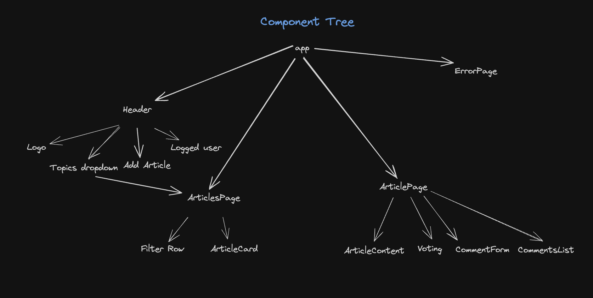
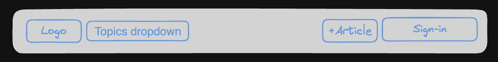
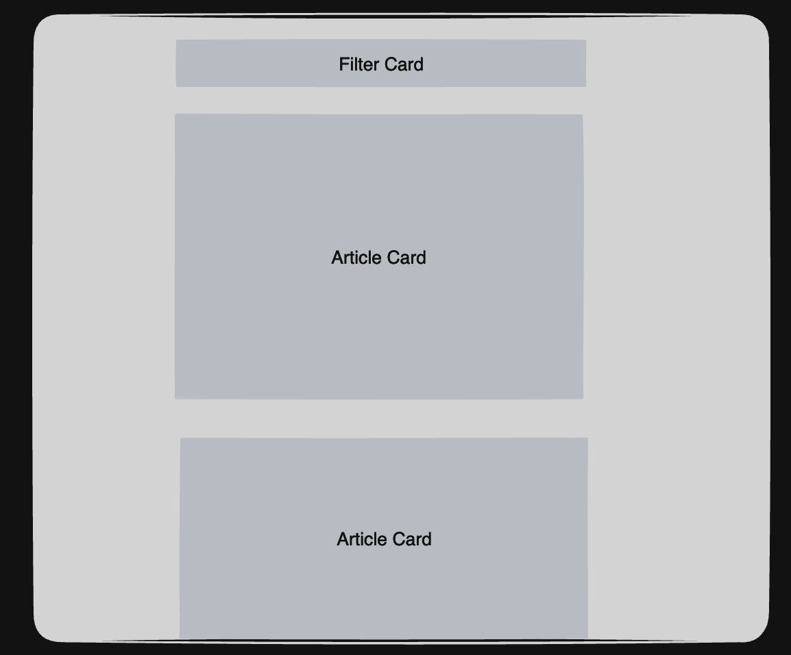
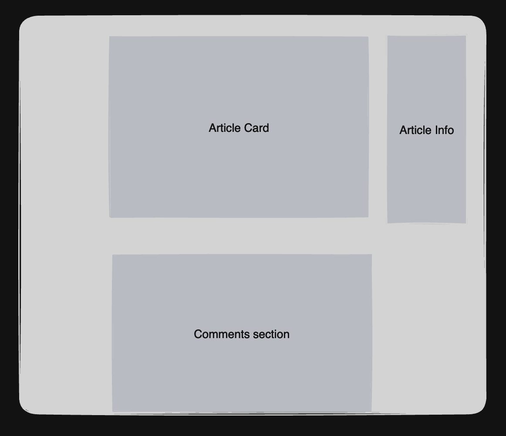
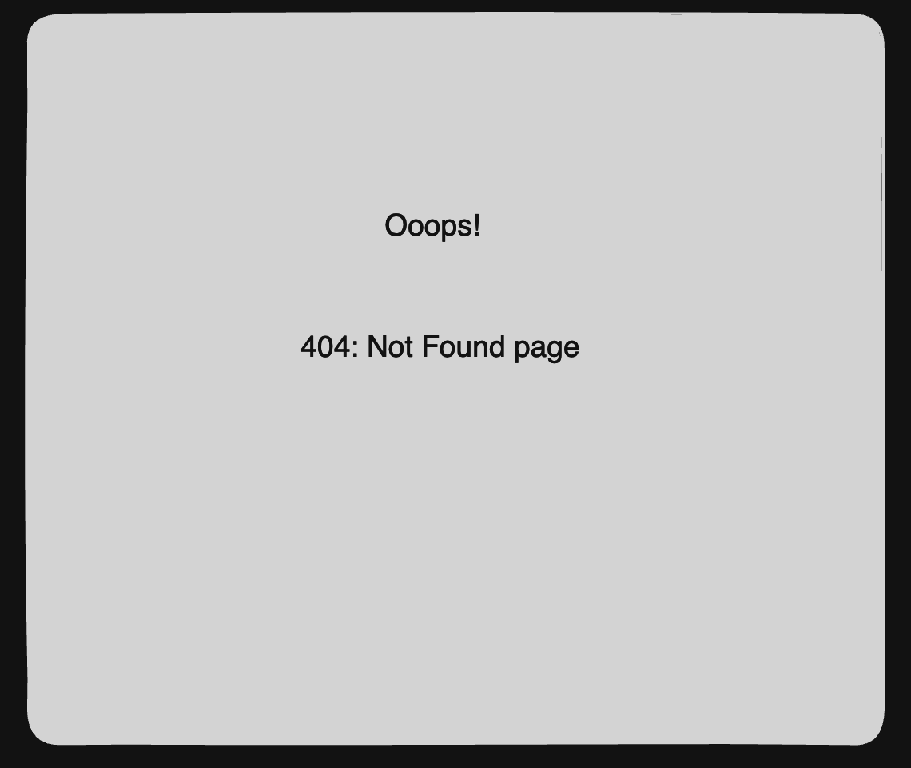

# Planning Documentation

# Table of Contents

## Component Tree

### States

App:
- Logged in user state (Hard coded for now)
- Articles List (passed down to ArticlesPage and TopicPage components)
- Votes Count (passed down to ArticlesPage and ArticlePage components)
- Comments (passed down to ArticlesPage and ArticlePage and TopicPage components)
- Global Error (passed down to ArticlesPage and ArticlePage and TopicPage components)
- Loading (passed down to ArticlesPage and ArticlePage and TopicPage components)

ArticlesPage:
- Articles List
- Votes Count
- Loading
- Global Error

ArticlePage:
- Article Content
- Votes Count
- Comments
- Input Comment
- Loading
- Global Error

ErrorPage:

### Routes

Route "/":
- Homepage/ArticlesPage

Route "/articles/:article_id":
- ArticlePage
  
Route "/articles/:topic_slug":
- ArticlesPage specific to topic selected
  
Route "*":
- ErrorPage which contains a 404: page not found display.

## Header Wireframe

## ArticlesPage Wireframe

## ArticlePage Wireframe

## ErrorPage

## FAQ

- Have a look at your API endpoints. Think about what data you have available, and how you will structure your application. What routes will your application have? What articles will you choose to display on the main page?
- Think how you will isolate the concerns of your project - the structure of your components, the sourcing of your data, the styling.
- What sort of routing will your app use? What sort of specificity do you think you will need? Remember, your URLs don't have to directly correspond to your API endpoints, but they will provide some guidance.
- Think about what data each component will need. Where will it come from? When should components find their own data and when should they load it themselves? Focus on the simplest functionality first.
- Authentication is something we do not have on our back end. You should hardcode a logged-in user.
Consider more complex functionality: how do you want to allow changes to your database? Think about how you will attribute users to posted comments etc. How will you know what comments/articles a user should be allowed to delete? How about sorting data, or paginating responses? A good starting point would be to pick a single user and assume that all new articles and comments are being posted by that user.
How are you going to make this a fluid and engaging experience for users so they want to come back for more?

## Assumptions
- Hard-coded logged in user
- Show all articles on homepage. (Would like to show featured articles instead, based on most amount of comments or most votes if given enough time)
- Ensure delete option is shown only to the hard-coded user
- Remember that the api endpoints have pagination and would need to add a page system on the page (Maybe have it automatically load when scrolled to the bottom)
- Use Loading states to indicate when data is being fetched.

