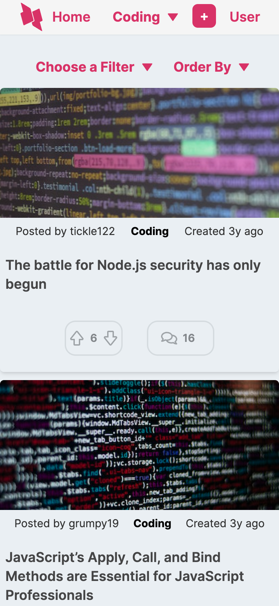
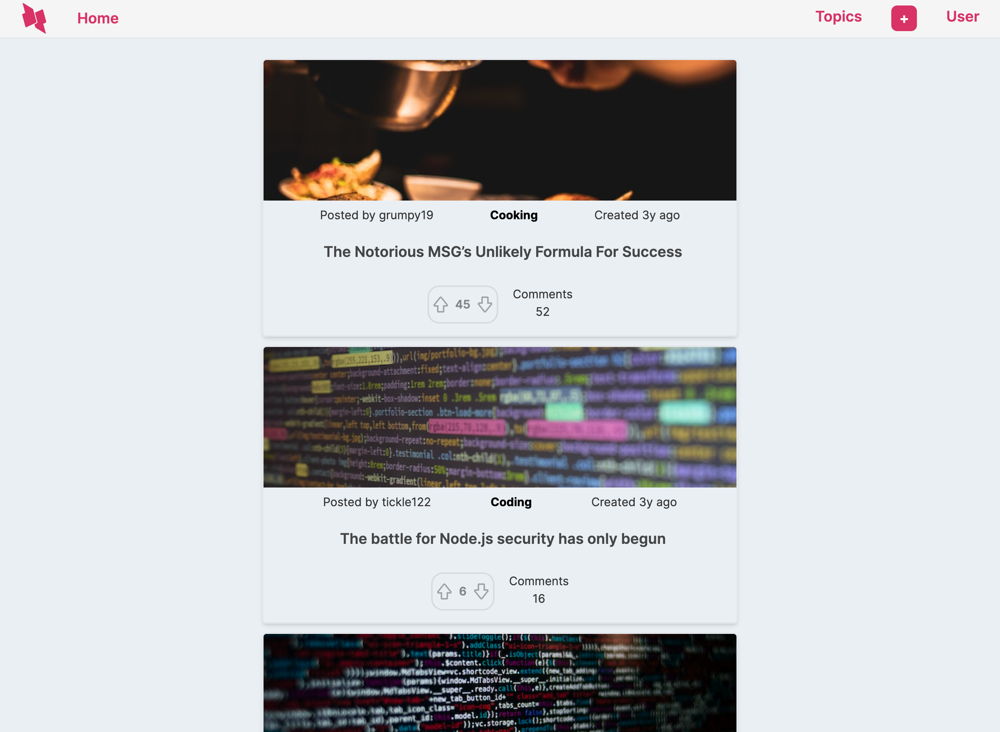

<a name="readme-top"></a>

[](https://github.com/RGBlife/news-api-ui/issues)
[](https://www.linkedin.com/in/bret-gomes/)

<br />

<div align="center">
  <a href="https://github.com/RGBlife/news-api-ui">
    
  </a>

<h3 align="center">Article Hub</h3>

  <p align="center">
    Article Hub is a platform that allows users to read, and engage with a variety of articles.
    <br />
    <br />
     <br />
    </strong>
    <a href="https://articlehub-ui.netlify.app/">View Demo</a>
    ·
    <a href="https://github.com/RGBlife/news-api-ui/issues">Report Bug</a>
    ·
    <a href="https://github.com/RGBlife/news-api-ui/issues">Request Feature</a>
  </p>
</div>

<details>
  <summary>Table of Contents</summary>
  <ol>
    <li>
      <a href="#about-the-project">About The Project</a>
      <ul>
        <li><a href="#screenshots">Screenshots</a></li>
        <li><a href="#built-with">Built With</a></li>
        <li><a href="#deployed-with">Deployed With</a></li>
      </ul>
    </li>
    <li>
      <a href="#getting-started">Getting Started</a>
      <ul>
        <li><a href="#prerequisites">Prerequisites</a></li>
        <li><a href="#installation">Installation</a></li>
      </ul>
    </li>
    <li><a href="#roadmap">Roadmap</a></li>
    <li><a href="#contributing">Contributing</a></li>
    <li><a href="#contact">Contact</a></li>
  </ol>
</details>

## About The Project

Article Hub is a simple, evolving project created to apply and showcase my skills as a Trainee Full Stack Developer. It's a platform centred around articles, facilitating reading and user interaction.

### Mobile Screenshot



### Desktop Screenshot



<p align="right">(<a href="#readme-top">back to top</a>)</p>

### Built With

<div align="left">

<p><a href="https://reactjs.org/"></a></p>

<p><a href="https://tailwindcss.com/"></a></p>

<p><a href="https://vitejs.dev/"></a></p>

<p><a href="https://axios-http.com/"></a></p>

<p><a href="https://www.framer.com/api/motion/"></a></p>

<p><a href="https://reactrouter.com/"></a></p>

<p><a href="https://react-select.com/"></a></p>

**API**: A custom API created for serving articles and related functionalities. It can be found [here](https://github.com/RGBlife/news-api).

</div>

### Deployed with

<div align="left">

<p><a href="https://app.netlify.com/sites/articlehub-ui/deploys"></a></p>

</div>

<p align="right">(<a href="#readme-top">back to top</a>)</p>

## Getting Started

### Prerequisites

Before you begin, ensure you have met the following requirements:

**[Node.js](https://nodejs.org/)**

### Installation

1. Clone the repo
   ```sh
   git clone https://github.com/RGBlife/news-api-ui.git
   ```
2. Navigate to the project directory
   ```sh
   cd news-api-ui
   ```
3. Install NPM packages
   ```sh
   npm install
   ```
4. Run the application
   ```js
   npm run dev
   ```
   The application should now be running on localhost:3000 or another port if you have configured it differently.

<p align="right">(<a href="#readme-top">back to top</a>)</p>

## Roadmap

<div align="left">

- [ ] Implement Light/Dark mode toggle.
- [ ] Enhancements to the article page and comments section.
- [ ] Implement infinite scrolling in the comments section.
- [ ] Add user login/profile functionalities, including avatar uploads.
- [ ] Develop features for adding articles and topics.
- [ ] Enhancements to the topics dropdown for a more intuitive user experience.
- [ ] Implement a global loading/error state using context for improved user feedback.

</div>

<br>
<p align="left">For a more detailed plan, please refer to the project’s to-do list.</p>

<p align="right">(<a href="#readme-top">back to top</a>)</p>
